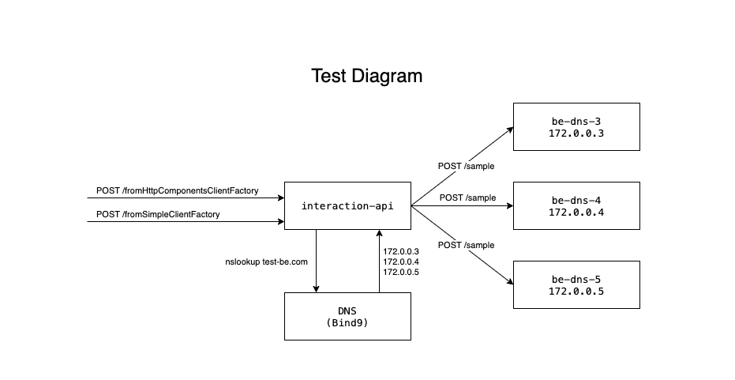

# Spring sample for DNS load balance integration

This project was created to test how spring would manage the http connections to a backend that runs multiple instances that are balanced trough a DNS load balance
This is the project test diagram;


## Running the project
you can run this project using docker compose or running one by one the containers.

### To run using docker compose;
run;
```sh
docker-compose up -d
```
stop;
```sh
docker-compose stop
```

### To run one by one

Follow the instructions on each folder;
* [DNS (Bind9)](/bind9)
* [Interaction API](/spring-sample/interaction-api)
* [Backend](/spring-sample/be)